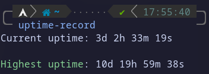

# Uptime Record - alba4k



### This useless script is just made to make it possible to have your highest-ever uptime saved somewhere - that way you can flex with your friends how maniac you are

---

## Usage

The uptime is updated every time the program is ran (if higher than the previous record), so all you need to do is run `uptime-record`.

The highest uptime ever recorded is saved in `$XDG_DATA_HOME/uptime-record`, usually `~/.local/share/XDG_DATA_HOME`. This file can be manually edited, but this would make you a cheater. Don't.

The program accepts some command line arguments, a help page can be found when running with the `--help` flag. 

## How to compile and install this program?

_I might publish an AUR package for this, should I?_

First of all, you need to clone this repository from github:

```shell
$ git clone https://github.com/alba4k/uptime-record
$ cd uptime-record
```

A compiled executable should already be present. You can run it directly or install for an easier access to it (it will be copied to `/usr/bin`):

```shell
# sudo make install
```

You might also want to compile it manually before you install it:

```shell
$ make
```

If you just compiled the source code, you might also want to reinstall the executable, as described earlier

## Tips and tricks

You might want to run this automatically before every shutdown or reboot. If you're using systemd (if you're not sure, then you probably are) you can easily achieve this by having some sort of executable (maybe a shell script or a symlink/copy) that runs the program in `/usr/lib/systemd/system-shutdown/`. Every executable file in this directory will be ran before your systemd turns off.

---

## © Aaron Blasko - 2022
###### I spent waaay too much time on this README lmao